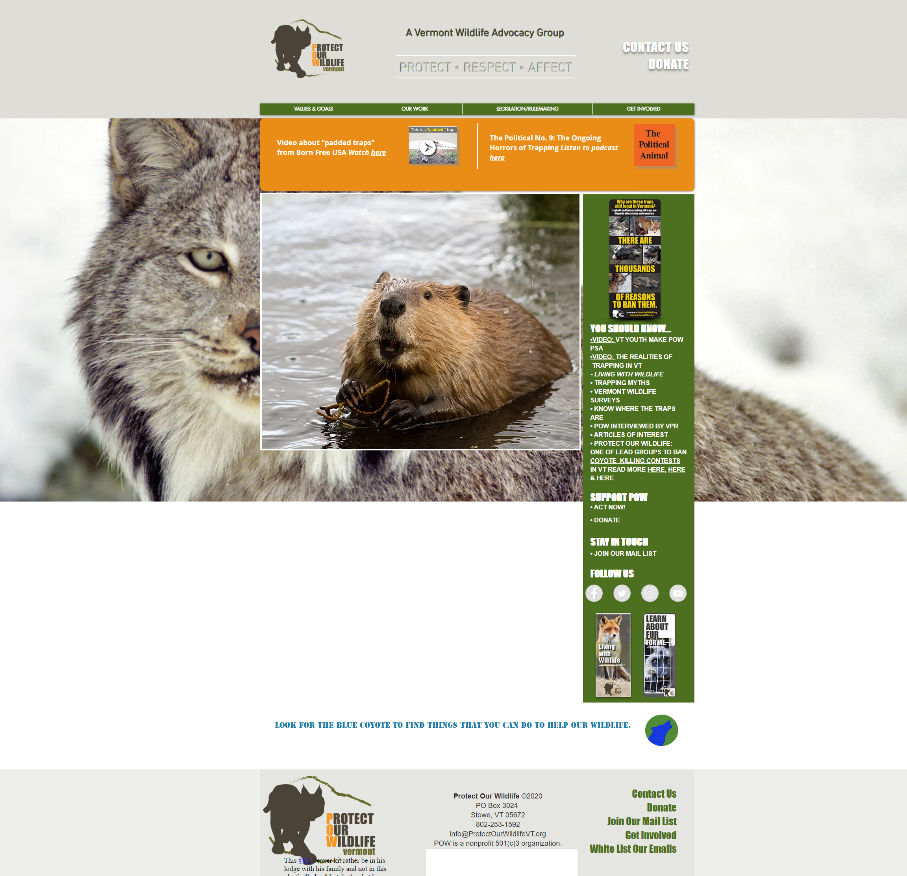

# Web Programming

## Documentation of my website

I made my website to an association “Protect our Wildlife Vermont”.

You can find the original website of this association here: https://www.protectourwildlifevt.org

And my website here: [http://powhomeworkbg.22web.org/HomePage.html](http://powhomeworkbg.22web.org/HomePage.html)

I uploaded my website application on a free host (https://byet.host/free-hosting/news)

You can also find my GitHub here: https://github.com/GregBND/WebHomework

**The original website:**

**My front page:**

The website is developed with Bootstrap framework, you can see on the left my both videos. The
first one (you can’t see it from my screenshot, but you can see it directly on my website) is from
YouTube, and the second one is from my own folder.

You can see also my menu on the top where you can change page. And on the footer the logo of the
association and the link to the original website.

**My second page:**

**My image gallery:**

You can see my image gallery here with all images in my website folder are automatically added on
this page. And you can upload your own images with the upload functionality on the left of the page.

**My fourth page :**

You can see here some text with some links inside.

**Contact page:**

Here you can see the contact page, and on the left the google maps address.
